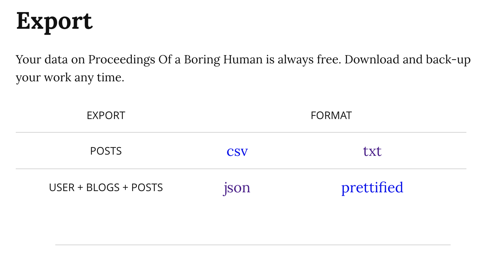

I love WriteFreely, I really do. And to my surprise it actually under a quite active development. The only complaint I have is that there's a feature I wanted so badly for a very very long time, but hasn't been added into the self-hosted version at all: inserting images in the WYSIWG editor.

Things happened over last year, on december 31, 2022, I still don't understand how it has happened, but I suddenly created a ticket on my personal Jira:


Notibly this is the first ticket ever in the Blog project, few months ago when I started to use jira to track my life, I created this one in advance to hold my blogging ideas. This is the first one actually, so it has to be done.

## Exporting data from WriteFreely

Exporting data is quite simple, you click on the "menu" then any random button that leds you to the admin dashboards. Then point your mouse at the topleft text (which is the title of your site), select "export".



- I did not bother with `csv`
- the `txt` export is just the text file in md/html format without front matter
  - the creation date is inferred in the file creation date, quite neat :)
- json file is the complete with all the meta data, including creation date,  publishing date, draft status and stats.

I used [Kagi](https://www.kagi.com) to find me some existing code to import a json file directly into hugo, but with no fruit.

Then I decided to roll my own. I don't really like feeling python gave me, but it's the easiest tool to do such thing. (bash + envsubst may seem more suitable, but writing bash gives me mental disorder).

## Parsing the `.json`

Using `fx` to do some basic reconing

```json
{
  "username": "hi",
  "has_pass": false,
  "email": "",
  "created": "2020-01-16T05:46:24Z",
  "status": 0,
  "collections": [
    {
      "alias": "hi",
      "title": "Quan Zhou",
      "description": "Exercise notes and other boring stuff",
      "style_sheet": "",
      "public": false,
      "views": 7329,
      "url": "https://qzhou.dev/",
      "total_posts": 12,
      "posts": [
        {
          "id": "rr7ig1j20a",
          "slug": "moving-writefreely-site-to-docker",
          "appearance": "norm",
          "language": "en",
          "rtl": false,
          "created": "2021-08-30T06:00:58.796478897Z",
          "updated": "2021-08-30T06:01:50Z",
          "title": "",
          "body": "Moving WriteFreely site to Docker\n\nThough I'm not a big fan of unnecessary containerization, a
          t some point, you'll want the convenience of the docker, you know, like eliminate the need to write custo
          m system-d unit files.\n\n<!--snip-->\n\nThe process was quite simple:\n\n```bash\nmkdir -p ~/dockers/blo
          g\ncd ~/dockers/blog\nmv /var/www/qzhou.dev/{config.ini,writefreely.db} ./\n\n# writefreely image is runn
          ing with uid(2), that's bad, but until they've fixed this I'll just chown.\nsudo chown 2:2 ./writefreely.
          db\n```\n\nThen create `docker-compose.yaml` file:\n\n```yaml\nversion: \"3\"\n\nservices:\n  writefreely
          :\n    container_name: \"writefreely_blog\"\n    image: \"writeas/writefreely:latest\"\n    volumes:\n
             - web-keys:/go/keys\n      - ./config.ini:/go/config.ini\n      - ./writefreely.db:/go/writefreely.db\
          n    ports:\n      - 127.0.0.1:8082:8080\n    restart: unless-stopped\n\nvolumes:\n  web-keys:\n```\n\nI'
          m using `cloudflared` so it was actually to make the move, simply just update the `/etc/cloudflared/confi
          g.yml`:\n\n(excerpt)\n\n```yaml\ningress:\n  - hostname: qzhou.dev\n    service: http://127.0.0.1:8082\n`
          ``\n\n`docker-compose up -d` and hooray~\n\n\n",
          "tags": [],
          "paid": false,
          "views": 55
        },
        {"id": "7hk3uovsx2", …},
        {"id": "e9ko6o48vm", …},
        {"id": "nh52inr1vw", …},
        {"id": "4arghwcow3", …},
        {"id": "rm14ftbkfp", …},
        {"id": "p41282740b", …},
        {"id": "8v9dgtla63", …},
        {"id": "c0iuopvmzt", …},
        {"id": "bv76iqehpe", …},
        {"id": "wg4icfws69", …},
        {"id": "linuy9lcxi", …},
        {"id": "kbbp7afdc3", …},
        {"id": "bqd6esny3c", …}
      ],
      "Format": null
    }
  ],
  "posts": [
    {"id": "85bos7srx0", …},
    {"id": "5oblvt1g6x", …}
  ]
}
```

The `.posts[]` are actually some drafts. The real posts are under `.collections[] | .posts[]`. Everything looks quite straightfoward, so I just need to get a template:

```jinja2
---
title: "{{ post.title }}"
date: {{ post.created }}
slug: {{ post.slug }}
draft: false
tags: {{ post.tags }}
math: false
toc: false
---

{{ post.body }}%
```

And render `posts[]` into files.

```python
# Untitled.ipynb
import json
from jinja2 import Environment, FileSystemLoader, select_autoescape

dump = json.load(open("hi-202212310951.json"))
posts = dump['collections'][0]['posts']
env = Environment(loader=FileSystemLoader("."),
									autoescape=select_autoescape())

template = env.get_template("template.md.jinja2")

for post in posts:
    template.stream(post=post).dump(f"{post['slug']}.md")
```


Then I got all the files

```noformat
╰─± tree
.
├── Untitled.ipynb
├── about.md
├── commit-security.md
├── disable-translations-in-apt.md
├── docker-started-using-192-168-0-0-16-subnets-all-of-in-sudden.md
├── enabling-encrypted-sni.md
├── hi-202212310951.json
├── just-when-you-want-to-use-systemctl-user-with-fish.md
├── less-preferable-releases-in-apt.md
├── moving-writefreely-site-to-docker.md
├── privacy-statements.md
├── revisiting-writefreely-configuration.md
├── simplifying-writefreely-configurations.md
├── template.md.jinja2
├── til-apt-takes-direct-in-proxy-statement.md
├── updating-a-vulnerable-tpm.md
└── write-up-setting-up-this-writefreely-blog.md

0 directories, 17 files
```

And it's done.

## Improvements (If I ever get to do this again)

I did this while we are waiting for a friend to wake up for dinner (yes dinner!), wanted only to finish it quick. But if I ever need to do this again, I would

* Use `post['created'].split("T")[0]-post['slug'].md`as filename. So I don't have to do it manually later
* use `with` statement when doing `open()`
* remove the `# title` , front matter included that one.
